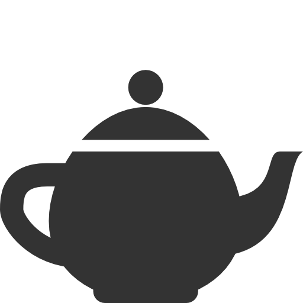

 <i class="fa fa-2x fa-graduation-cap"></i>
 <i class="fa fa-2x fa-terminal"></i>
 <i class="fa fa-2x fa-puzzle-piece"></i>
 <i class="fa fa-2x fa-paint-brush"></i>
 

I am a soon-to-be graduate from Computer Science at the University  
of Waterloo, with minors in Computational Mathematics and Fine Arts. 

I have a passion for all things graphics, a keen interest in exploring the 
connections between art and technology. 

When I am not investigating the latest technologies, you can find me 
climbing a rock wall, experimenting with new recipes, or curled up 
with good book and a mug of chai tea.
